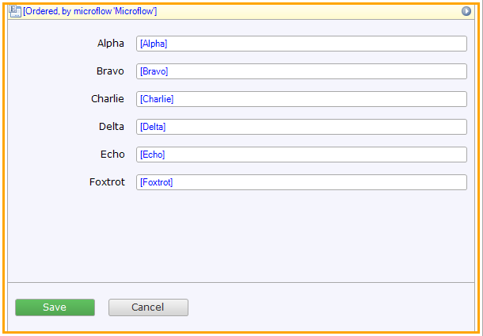
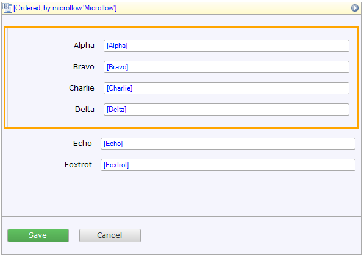
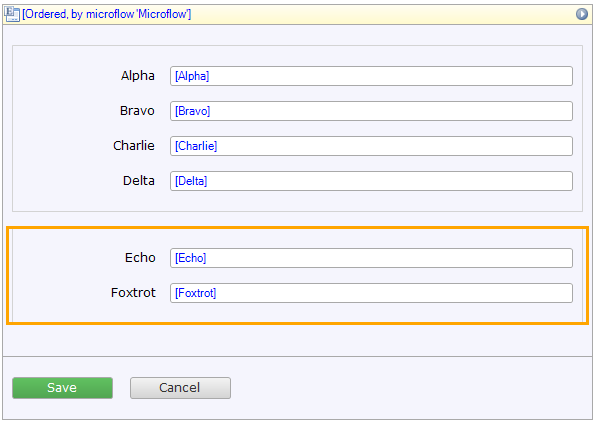
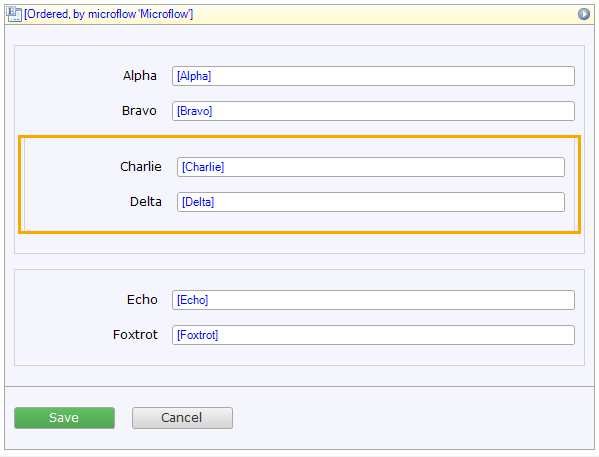
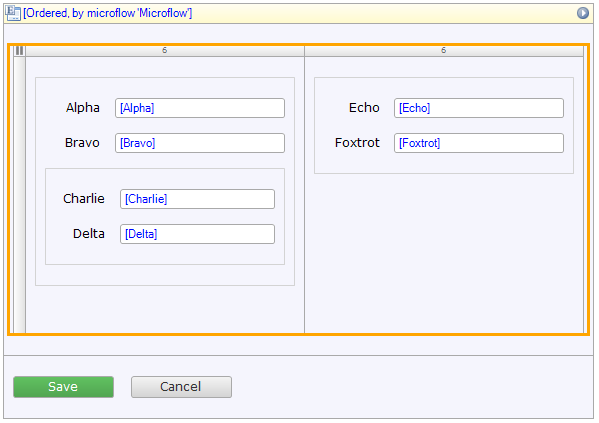
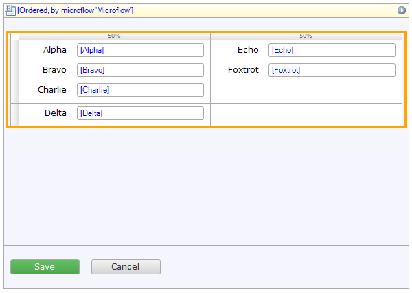
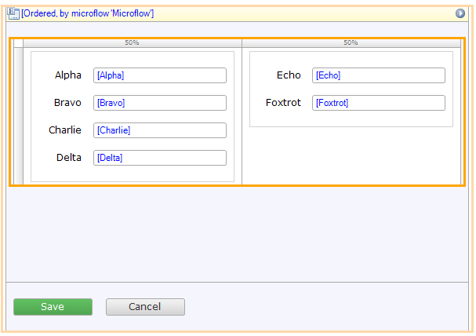

## 1 Introduction
When the user uses the tab-key to move between inputs the browsers determines the order based on the structure of
your pages. If you want to deviate from that, you can specify a tab index on your inputs or restructure your page. 
It is preferred to use restructuring over setting a tab index so there is no difference for screen readers when 
reading the page and the navigation order of the page which improves the web accesibility of your app. 
In this how-to we describe what the natural tab-order of a page is and how it is influenced when adding containers. 

## 2 How to order inputs without tab indices

### 2.1 What is natural ordering
When you model a page without specifying a tab index anywhere, the browser determines how the tabbing navigates through
your page. Any kind of focusable input is part of the tab order, like text box, checkbox and date picker. 
This is done based on the structure of your page using a process called depth-first traversal.

### 2.2 A simple list of inputs

In this example page we added 6 different inputs. Because this is just a simple list the tabbing order is identical to the
order they appear in the page.

### 2.3 Using containers to group inputs
We can group multiple inputs within a container. When traversing through this page the browser finds the container first, 
and traverses through the four inputs inside the container before moving on to the remaining two inputs. In this example the 
resulting order is the same.

We now also grouped the remaining two inputs within a container. The browser will first traverse through the first container
and then through the second one. This still results in the same tab order.

#### 2.4 Nesting containers
You can also use nested containers. In this example when traversing the first container the browser will traverse throught the first
two inputs, then through two inputs inside the nested container and continues with the two inputs in the last container.
Once again this still results in the same tab order.

### Using containers in a layout grid
### <super cool img LayoutedContainers.PNG>
A layout grid is also a container which contains rows and columns. It will traverse the columns of one row before moving
on to the next. In the example we placed the first container in the left column and the second one in the right column.
The order of the inputs is still the same because of the structure of the page, but they are now positioned differently.

### 2.5 Using inputs in a table
### <super cool img TableLayout.PNG>
A table is another container with rows and columns. Similar to the layout grid it will traverse the columns
of one row before moving on to the next row. In the example we placed every input in it's own column. This will
change the order of the inputs compared to the layout grid. When tabbing through the inputs the browser will first visit
the first row (Alpha and Echo), then the second row (Bravo and Foxtrot) and then the remaining inputs on the last two
rows (Charlie and Delta).

When you want to have the same order as in the layout grid example, you need to ensure that Alpha, Bravo, Charlie and Delta
are traversed first. The way to do that is to group the inputs using a container. 

Using tables for layouting purposes is discouraged, using a layout grid is preferred.

## 4 Related Content

{Do not enter anything here, this will be generated by Mendix}
